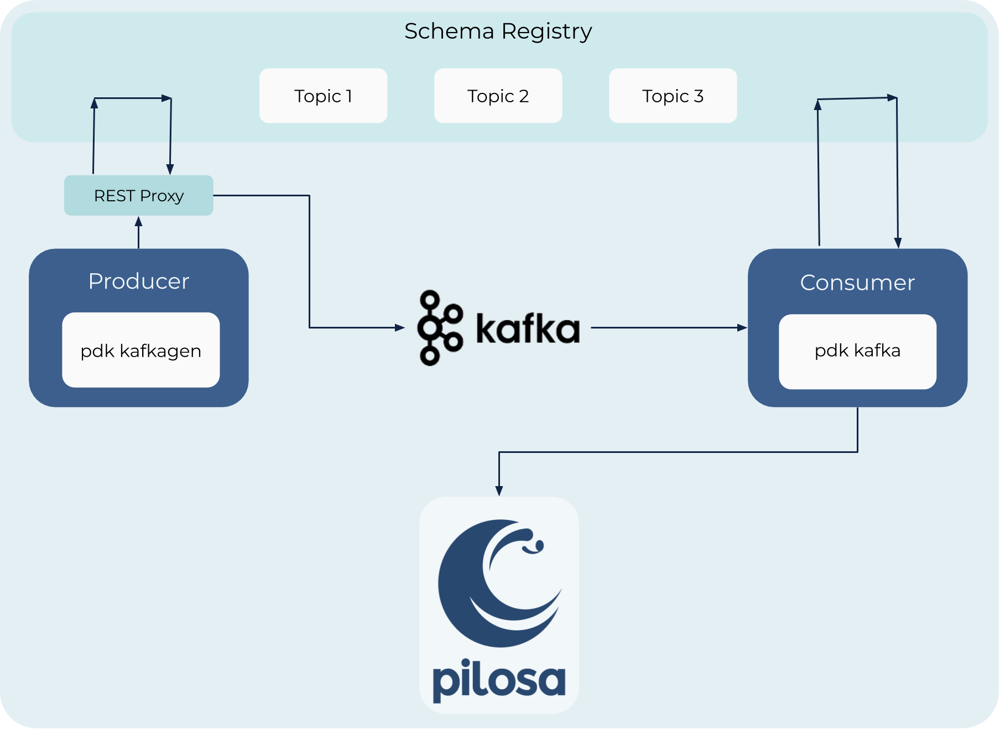

# pdk kafka

Pilosa supports a Kafka interface. For complete documentation on Kafka, please visit their Apache Foundation [documentation](https://kafka.apache.org).

## Overview

Pilosa's `pdk kafkagen` is a Kafka Producer. It generates random data and uses the REST proxy to load the data into Kafka. The REST proxy converts the JSON data produced by the `pdk kafkagen` command into an Avro ID and message that Kafka can interpret. Each JSON object has a corresponding Avro ID and message. The REST proxy acquires the Avro ID by querying the Schema Registry, which is only queried for every new schema. After the REST proxy receives the Avro ID, it can decode the JSON message and send both to Kafka. Producers other than `pdk kafkagen` can send data straight to Kafka or query the Schema Registry directly, as long as they are formatted correctly.

Once the data is in Kafka, Pilosa can use `pdk kafka`, which is a Kafka Consumer, to access the data and ingest it into Pilosa. `pdk kafka` queries Kafka and receives the Avro ID and message that will be ingested into Pilosa. After receiving the Avro ID and message, the `pdk kafka` command will query the Schema Registry and procure the JSON object that corresponds to the Avro ID. Similar to the REST proxy, `pdk kafka` will only query the Schema Registry for new schema. Once `pdk kafka` has the JSON object, it can decode the message and send both to Pilosa for ingest. Consumers other than `pdk kafka` operate in a similar manner, although they may add complexity.



Please see Confluent's documentation for more information regarding:
* [REST proxy](https://docs.confluent.io/current/kafka-rest/index.html)

* [Schema Registry](https://docs.confluent.io/current/schema-registry/index.html)

Please see Pilosa's documentation regarding the Pilosa [data model](https://www.pilosa.com/docs/latest/data-model/)

## Loading Data From Kafka Into Pilosa

To load data from Kafka into Pilosa, simply run `pdk kafka` while both Kafka (along with Confluent's Schema Registry and REST proxy) and Pilosa are running. To ensure that the Kafka components are running, Kafka can be started using:

```
<confluent directory>/bin/confluent start
```

For more information about gettting started with Confluent and Kafka, please see their [documentation](https://docs.confluent.io/current/quickstart/index.html).

## Querying the Data

Once the data in Kafka is ingested by Pilosa, Pilosa can be operated as usual. For a complete guide to the query operations in the official Pilosa clients, please see the following:

* [Go](https://github.com/pilosa/go-pilosa)

* [Java](https://github.com/pilosa/java-pilosa)

* [Python](https://github.com/pilosa/python-pilosa)

* [Curl](https://www.pilosa.com/docs/latest/query-language/)